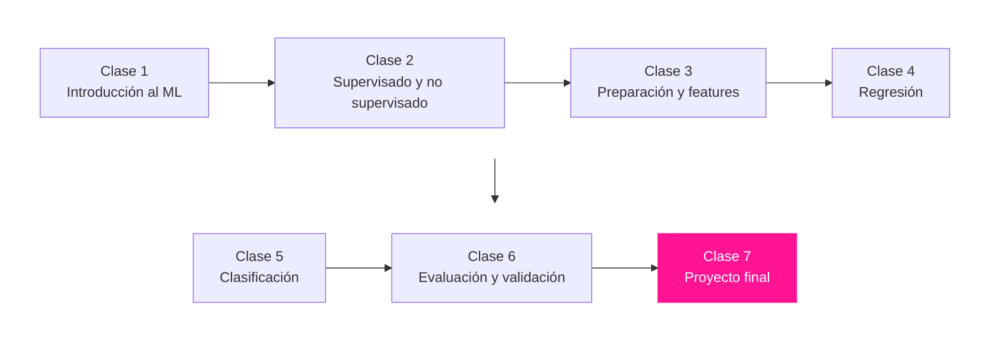

# 🐥 Curso de Machine Learning con la Miss Yera

Curso completo de machine learning en 7 clases con un solo hilo narrativo, **PolliCreditos**, una fintech peruana de microcréditos para bodegas y emprendedores. Cada clase resuelve un pedido real del CEO, y cada error del modelo cuesta soles concretos. De tu primera predicción a un proyecto final de fuga de clientes con estándar senior.

Cada clase tiene su video en la playlist de YouTube, su notebook para practicar en Colab sin instalar nada, quizzes con alternativas, la trampa de la Miss para cazar errores, la capa de matemática detrás de cada concepto y autoverificación del reto.

**Regla de oro del curso, nadie ejecuta una celda sin predecir en voz alta qué va a pasar.**

## 🧭 El mapa del curso

## 📺 Las clases

| # | Clase | Video | Notebook |
|---|---|---|---|
| 1 | **Tu primera predicción, ¿a quién le presta PolliCreditos?** | _pendiente_ |  |
| 2 | **Supervisado o no supervisado, el mapa que evita el 80% de los errores** | _pendiente_ |  |
| 3 | **El 70% del trabajo real, limpiar las solicitudes de crédito** | _pendiente_ |  |
| 4 | **Regresión, ¿qué línea de crédito darle a cada bodega?** | _pendiente_ |  |
| 5 | **Clasificación, ¿quién caerá en mora? Cada error cuesta soles** | _pendiente_ |  |
| 6 | **Overfitting en vivo, la auditoría del regulador** | _pendiente_ |  |
| 7 | **Proyecto final, la fuga de los buenos clientes de punta a punta** | _pendiente_ |  |

Los links de video se completan a medida que salen los episodios de la playlist.

## 🎒 Cómo usar este repositorio

1. Abre el notebook de la clase con su botón de Colab, no necesitas instalar nada.
2. Sigue el video completando los espacios marcados con ✏️ TU TURNO.
3. Usa la celda de autoverificación para confirmar que tu reto está completo.
4. Comparte tu resultado en los comentarios del video con el hashtag #PollitosML.
5. La solución oficial de cada reto se publica en `soluciones/` una semana después del video. Intenta primero, ahí está el aprendizaje.

## 📁 Estructura

- `clases/` los notebooks de estudiantes, uno por clase, con espacios para completar y autoverificación.
- `soluciones/` la versión resuelta y ejecutada de cada clase (se publica con delay).
- `assets/` los diagramas del curso en Mermaid, PNG y las animaciones GIF.
- `requirements.txt` para correr en local (en Colab no hace falta).

## 🐥 ¿Quién enseña?

Yera Flores (Miss Yera), consultora de IA y datos, y profe de este gallinero. Más cursos y el Full Day de IA en [missyera.com](https://missyera.com), y análisis gratuito de tu CV con IA en [misscv.com](https://misscv.com).

**Chau, chau. Bye, bye. 💋**

© 2026 Yera Flores (Miss Yera) · @soymissyera
